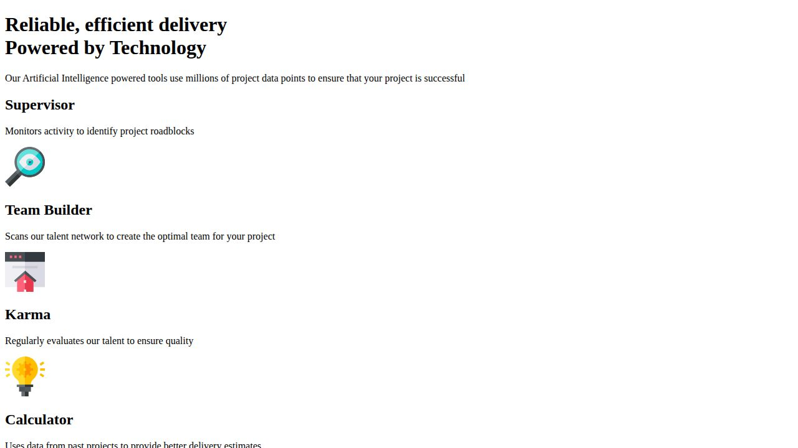
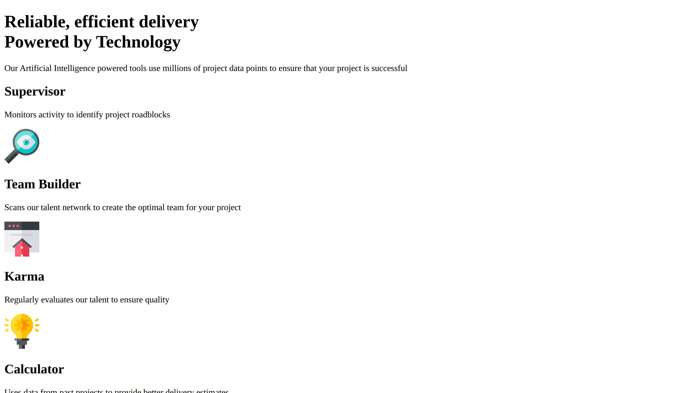
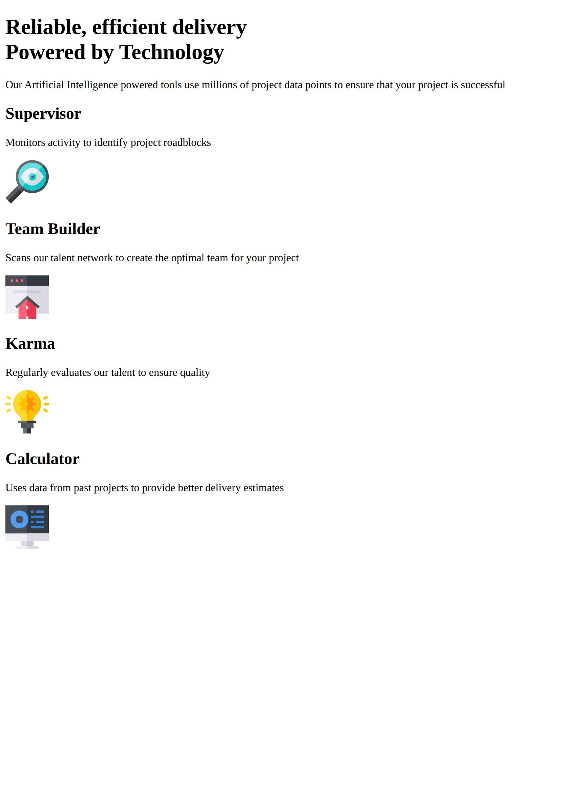
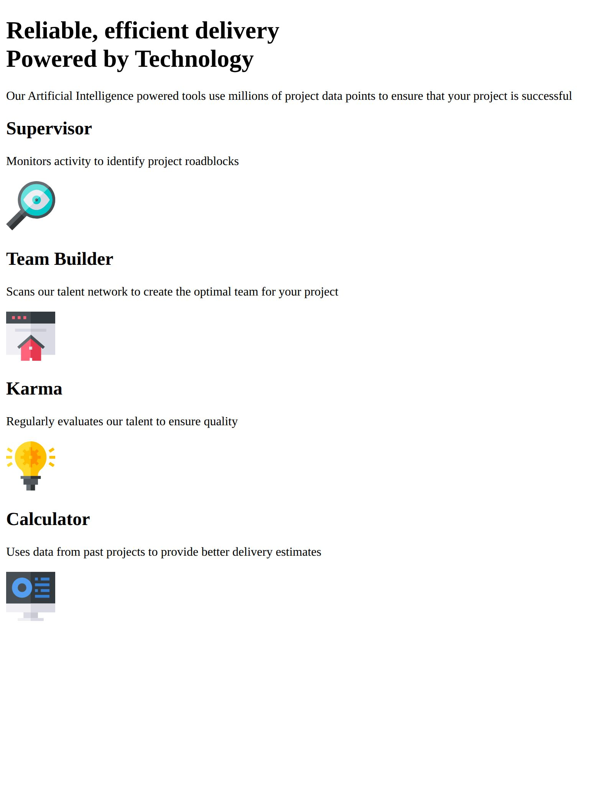
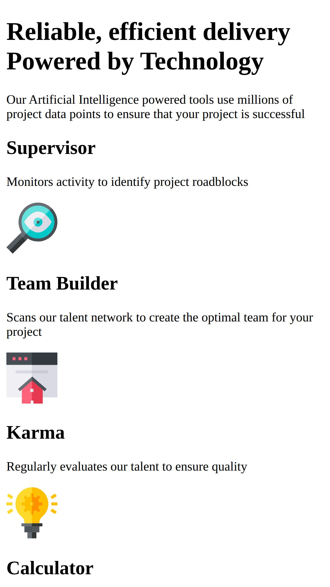
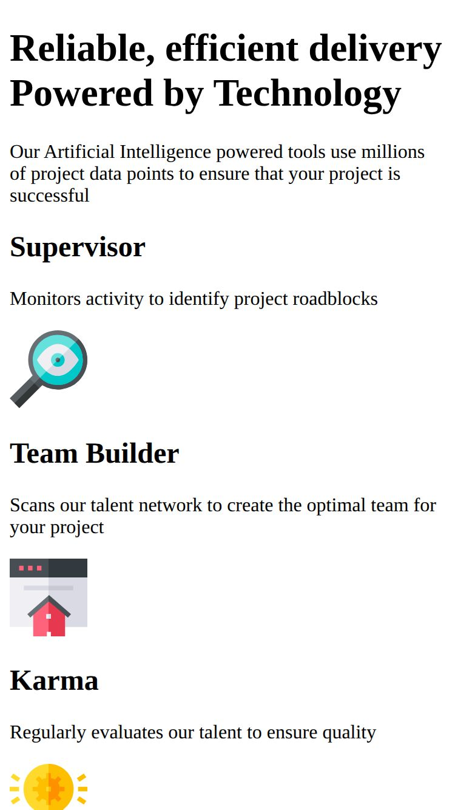

# Frontend Mentor - Four card feature section solution

This is a solution to the [Four card feature section challenge on Frontend Mentor](https://www.frontendmentor.io/challenges/four-card-feature-section-weK1eFYK). Frontend Mentor challenges help you improve your coding skills by building realistic projects.

## Overview

### Screenshots

| Desktop                                    | Desktop HIDPI                                          |
| ------------------------------------------ | ------------------------------------------------------ |
|  |  |

---

| Tablet                               | Small tablet                     |
| ------------------------------------ | -------------------------------- |
|  |  |

---

| Phone                                    | Small phone                    |
| ---------------------------------------- | ------------------------------ |
|  |  |
